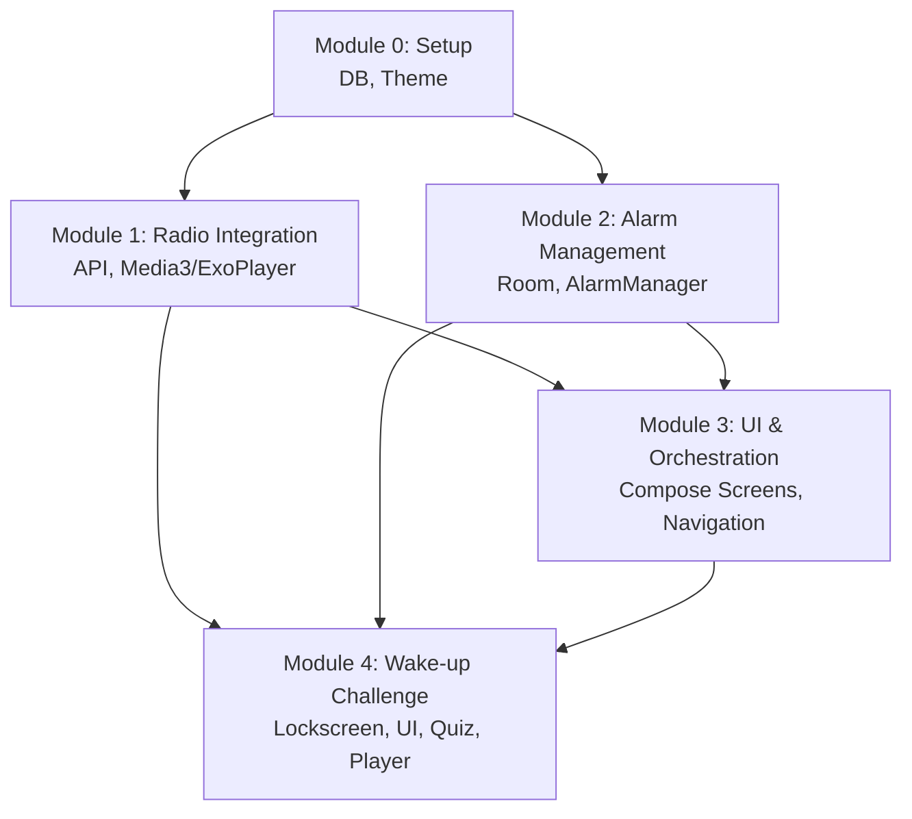

# Global Architecture & Module Orchestration

## 1. Global Tech Stack

| Category | Technology | Version / Rule |
| :--- | :--- | :--- |
| **Language** | Kotlin | `1.9.x` (Pure Kotlin) |
| **Build System** | Gradle (Kotlin DSL) | `8.x` |
| **Android SDK** | Min SDK 26, Target SDK 34 | Support modern background execution |
| **UI Framework** | Jetpack Compose | `1.6.x+` |
| **Architecture** | MVVM with Coroutines/Flow | Unidirectional Data Flow |
| **Networking** | Retrofit 2 + OkHttp | `2.11.x` |
| **Media Player** | ExoPlayer (via Media3) | `1.3.x` (Robust stream handling) |
| **Local Storage** | Room Database | `2.6.x` |
| **Background / Alarms** | `AlarmManager` | Exact alarms (`USE_EXACT_ALARM`) |

## 2. Global Design Rules

* **Aesthetics:** "A little bit different > a little bit better."
* **Color Palette:** 
    * Background: Pitch Black (`#000000`) for OLED power saving when the alarm goes off.
    * Accents: Neon Red (`#FF204E`) / Electric Blue (`#00E5FF`) to provide high contrast waking up.
* **Typography:** Bold, highly legible sans-serif font (e.g., `Inter` or `Roboto`), huge numbers for time.
* **Interaction:** Large tap targets (minimum 48dp). The key interaction is the **Hold-to-Confirm** gesture which requires a clear visual fill state.
* **State Management:** All screens follow `Loading` -> `Success` -> `Error` states.

## 3. Global Data Model

| Entity | Key Fields | Relationships | Storage Hint |
| :--- | :--- | :--- | :--- |
| **Alarm** | `id`, `time_hour`, `time_min`, `days_of_week` (bitmask/list), `is_enabled`, `station_uuid`, `station_name` | One-to-One with Station (embedded fields) | Room DB |
| **FavoriteStation** | `station_uuid`, `name`, `url_resolved`, `favicon`, `codec` | Independent | Room DB |
| **RadioStation** | `stationuuid`, `name`, `url_resolved`, `favicon`, `tags` | Ephemeral (Fetched from API) | Memory / Cache |

## 4. Module List & Dependencies

* **Module 0: Setup** (`0-setup.md`) - Project init, dependencies, base theme, and Room DB setup.
* **Module 1: Radio Integration** (`1-radio.md`) - Retrofit setup, Radio Browser API integration, ExoPlayer setup for background/foreground playback. Depends on Module 0.
* **Module 2: Alarm Management** (`2-alarms.md`) - CRUD operations for alarms, `AlarmManager` scheduling, Boot receiver. Depends on Module 0.
* **Module 3: UI & Orchestration** (`3-ui_orchestration.md`) - Home Screen (list), Explore Radio Screen (search/favorites), Add/Edit Alarm Screen. Ties Module 1 and 2 together.
* **Module 4: Wake-up Challenge** (`4-challenge.md`) - The Lockscreen Activity triggered by the alarm. Plays stream, shows multiple-choice quiz, handles 3-second hold gesture, and executes dismissal. Depends on Modules 1, 2, 3.

## 5. Dependency Visualization

## 6. Cross-Module Risk Chains

* **Playback & Doze Mode (M1 -> M2 -> M4):** The most critical risk. Android strictly limits background execution. `AlarmManager` (M2) must trigger a Foreground Service/Activity (M4) that instantly prepares ExoPlayer (M1) before the device goes back to sleep. Network latency fetching the radio stream could cause an ANR or failure if not offloaded correctly. 
    * *Mitigation:* The Wake-up Challenge (M4) must start a fallback ringtone immediately if ExoPlayer (M1) takes more than 3000ms to buffer.
* **Exact Alarms Permission (M2):** Android 14+ requires explicit user consent for `SCHEDULE_EXACT_ALARM`. 
    * *Mitigation:* Module 3 must handle the permission flow smoothly during alarm creation.
