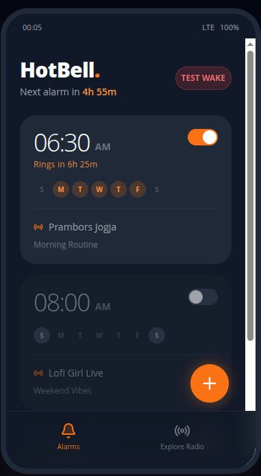
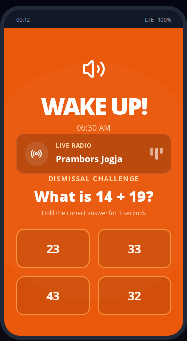
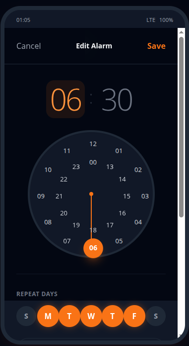
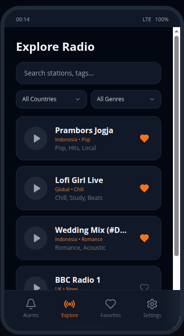
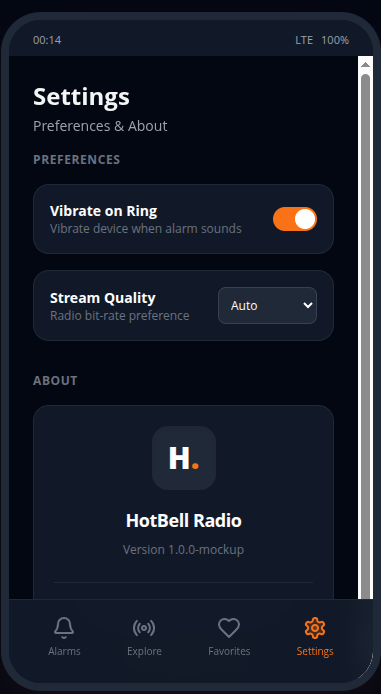
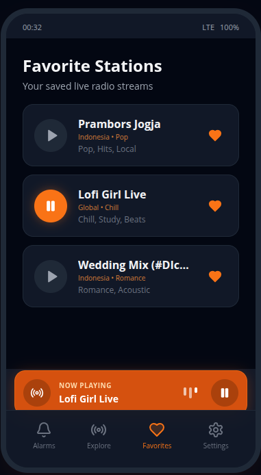

# 
🔔 HotBell Radio

  
  
  

  <b>A premium, "different" Android alarm clock that ensures you never oversleep again.</b>

---

## 🚀 Why HotBell?
Deep sleepers often get used to standard ringtones and snooze through them without even noticing. **HotBell Radio** breaks that cycle by combining:
1.  **Unpredictable Audio**: Wake up to live internet radio stations from across the globe.
2.  **Cognitive Trigger**: Solve a math challenge to dismiss the alarm.
3.  **Physical Commitment**: A "Hold to Confirm" gesture ensures you are conscious and focused.

---

## ✨ Features

- 🌍 **Global Radio Access**: Connect to thousands of live stations via the [Radio Browser API](https://www.radio-browser.info/).
- 🧠 **Smart Dismissal**: Multiple-choice math quizzes with haptic and visual feedback.
- 🔊 **Crescendo System**: Starts at 10% volume and gracefully scales to **150%** for the most stubborn sleepers.
- 🎨 **Premium UI/UX**: Full Pitch Black dark mode with neon accents and a global **Now Playing** bar.
- ⚙️ **Reliability Focused**: Built-in support for Exact Alarms, Battery Optimization, and Lock Screen Bypass.
- 🔄 **Auto-Updates**: Built-in "Check for Updates" tool to keep you on the latest version directly from GitHub.

---

## 🖼️ Gallery & Mockups

| Home & Planning | Experience & Interaction | Exploration |
| :---: | :---: | :---: |
|  |  |  |
| *Clean Alarm List* | *Cognitive Challenge* | *Global Stations* |
|  |  |  |
| *Modern Time Selection* | *Deep Configuration* | *Persistent Playback* |

---

## 🛠️ Tech Stack
- **Language**: Kotlin 1.9.x
- **UI**: Jetpack Compose + Material 3
- **Audio**: ExoPlayer (Media3) with Loudness Enhancer
- **Database**: Room Persistence Library
- **Networking**: Retrofit, OkHttp, GSON
- **CI/CD**: GitHub Actions (Release Optimized)

---

## 🔓 Permissions Guide
To guarantee 100% reliability, HotBell requires these permissions (configurable inside the App Settings):
*   **Notifications**: Essential for background playback visibility.
*   **Battery Optimization**: Prevents the system from "sleeping" through your alarm.
*   **Full-Screen Intent**: Required to show the wake-up screen while the device is locked (Android 14+).
*   **Exact Alarms**: Precision timing for Android 12+.

---

## 📦 Getting Started
1. Clone the repo: `git clone https://github.com/arinadi/HotBell-Radio.git`
2. Open in Android Studio.
3. Use the **Release** build variant for the best experience.
4. Add your signing keys in GitHub Secrets if you want to use the build workflow.

---

  <i>"A little bit different > a little bit better."</i>

